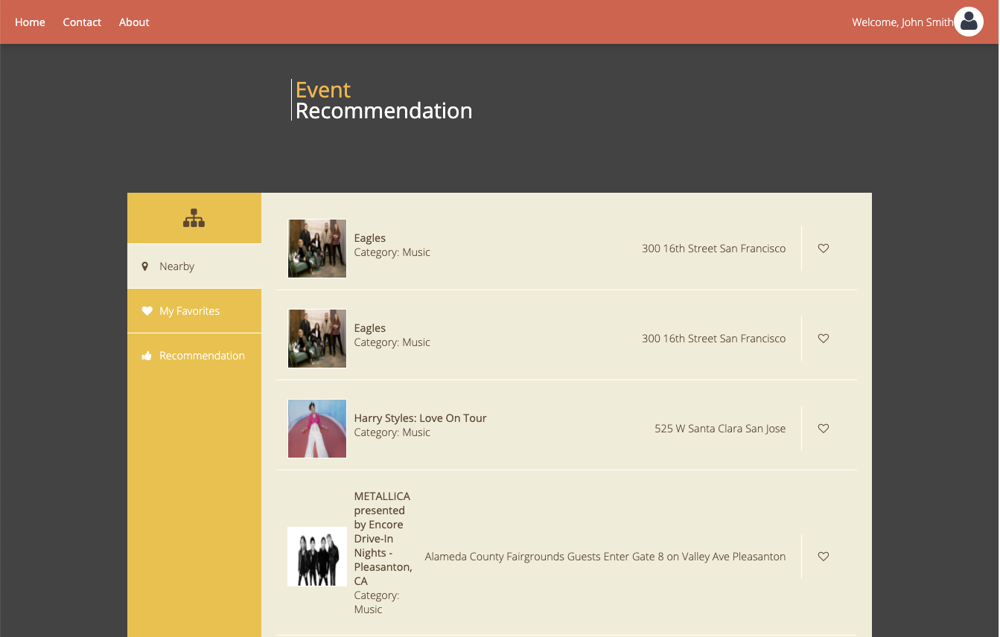

# EventFinder

## Business Insight

- On this EventFinder website, people can explore nearby events such as concerts, sports games from Ticketmaster.com. Additionally, add their favorite events, and get the recommended events based on their likes. 
## Overview

**Three functions**: 
- 1, search the nearby events;
- 2, add your favorite events as well as manage the records;
- 3, get recommended events that users may like.

**Front-end**: an interactive web page implemented with HTML, CSS, JavaScript as well as AJAX technique. 

**Back-end**: Java, MySql, MongoDB 

**Cloud**: deployed on Amazon EC2 

**Traffic Analysis**: Analyze website traffic both online and offline with ELK(ElasticSearch, Logstash and Kibana) and MapReduce in MangoDB 

